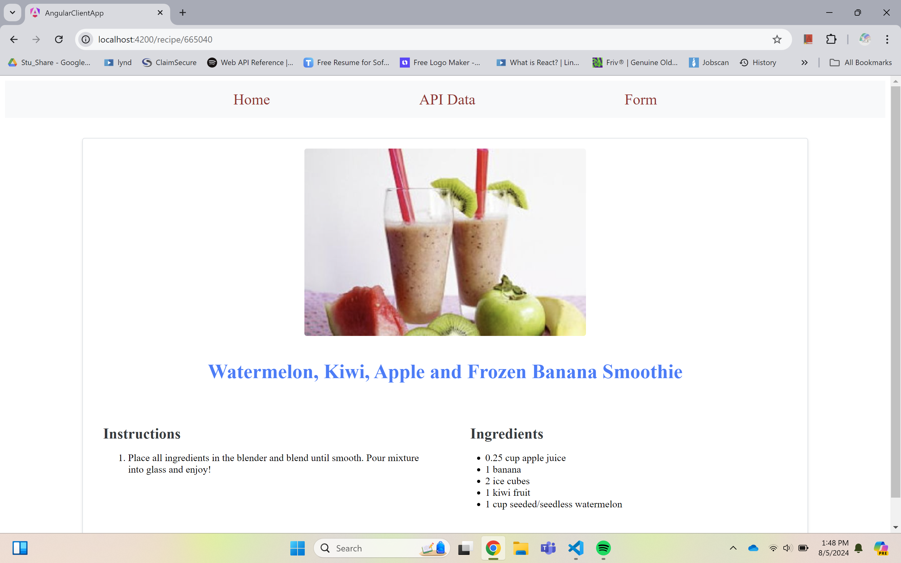

# AngularClientApp

This project was generated with [Angular CLI](https://github.com/angular/angular-cli) version 18.1.0.

## Development server

Run `ng serve` for a dev server. Navigate to `http://localhost:4200/`. The application will automatically reload if you change any of the source files.

=====================
Deployment Link: 

https://angular-food-recipe-kappa.vercel.app/

=====================

Application Features

=====================

Home Page: Displaying Recipe API and Angular details. 

Recipe API Page: Fetches and displays recipes using the Spoonacular API.

Recipe Details Page: Shows detailed instructions and ingredients for selected recipes.

Add Recipe Page: Allows users to submit their own recipes with category, ingredients, and instructions.

=====================

Home Page

Recipe API Page

Recipe Details

Adding Recipe form

Added Recipes

